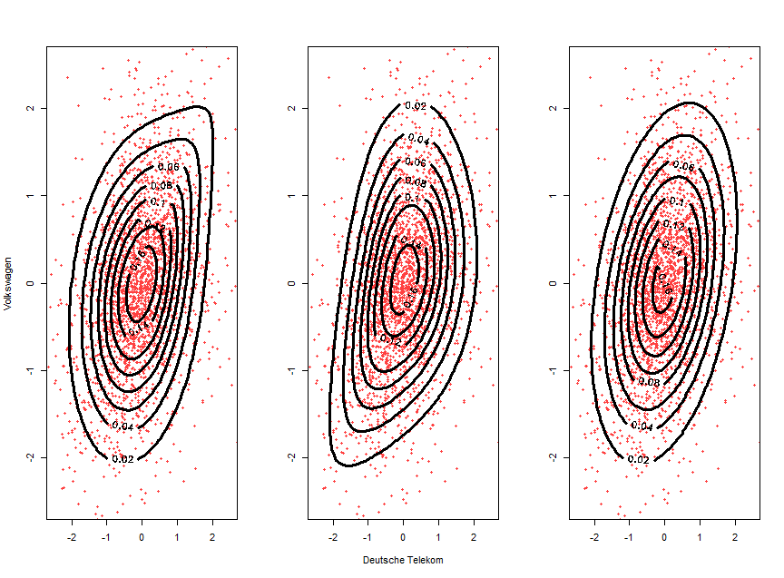

[](http://quantlet.de/)

## [](http://quantlet.de/) **SFEstaticCop** [](http://quantlet.de/)

```yaml

Name of QuantLet: SFEstaticCop

Published in: Statistics of Financial Markets

Description: 'plots the contour of the Gumbel, Clayton and Normal copula. These 
              copulae are based on Normal margins. The fitted, empirical residuals 
              are included in the plot as red dots.'

Keywords: garch, copula, plot, normal, gumbel, clayton, Kendalls Tau,  density, distribution

See also: BCS_ClaytonMC, SFEclaytonMC, SFEdynCop, SFEgaussCop, SFEtCop, SFEtMC, SFEtMC, SFScontourgumbel, SFScontourgumbel

Author: Ostap Okhrin, Piedad Castro

Submitted: Wed, June 29 2016 by Piedad Castro

Input: 'The datafile contains daily price data from 07.05.2004 to 07.05.2014 for 
selected companies which are part of DAX30 and FTSE100 as well as the 
corresponding index data. This code makes use of the daily prices for the Deutsche 
Telekom and Volkswagen.'

```



### R Code
```r

# clear variables and close windows
rm(list=ls(all=TRUE))
graphics.off()

# set working directory
#setwd("C:/...")
setwd("D:/Trabajo HU")

# install and load packages
libraries = c("data.table", "fGarch", "copula")
lapply(libraries, function(x) if (!(x %in% installed.packages())) {
  install.packages(x)
})
lapply(libraries, library, quietly = TRUE, character.only = TRUE)

# load data
dataset = fread("2004-2014_dax_ftse.csv", select =  c("DEUTSCHE TELEKOM", "VOLKSWAGEN"))
dataset = as.data.frame(dataset)

# log-returns
X = lapply(dataset, 
           function(x){
             diff(log(x))
           })

garchModel = lapply(X, 
                    function(x){
                      garchFit(~garch(1, 1), data = x, trace = F)
                    })

eps = lapply(garchModel, 
             function(x){
               x@residuals/x@sigma.t
             })

eps = as.data.frame(eps)

means = colMeans(eps)
sds   = sapply(eps, sd)

params.margins = list(list(mean = means[[1]], sd = sds[[1]]), 
                      list(mean = means[[2]], sd = sds[[2]]))

# kendall's tau
tau = cor(eps, method = "kendall")[1,2]

gumbel.tau2theta  = function(tau){
  1/(1 - tau)
}

clayton.tau2theta = function(tau){
  2 * tau / (1-tau)
}

normal.tau2theta  = function(tau){
  sin(tau * pi/2)
}  

# this function specifies which multivariate distribution constructed from copula is used 
# (based on normal margins)
renditen.copula.fun = function(copula.name, tau, params.margins){
  
  # marginal distributions
  marg = rep("norm", length(params.margins))    
  
  # the parameter of the specified Archimedean copula are defined above, e.g. gumbel.tau2theta                                                                           
  if(copula.name == "gumbel"){                                                   
    gumbel.cop = gumbelCopula(gumbel.tau2theta(tau))                             
    out        = mvdc(gumbel.cop, marg, params.margins)
  }
  else if(copula.name == "clayton"){                                           
    clayton.cop = claytonCopula(clayton.tau2theta(tau)) 
    out         = mvdc(clayton.cop, marg, params.margins)
  }
  else if(copula.name == "normal"){
    normal.cop = normalCopula(normal.tau2theta(tau))
    out        = mvdc(normal.cop, marg, params.margins)
  }
  return(out)
}

# contour plot 
xylim = 2.5 # it is advised to keep the xylim, in order that the contour lines can be recognized
layout(matrix(c(1,2,3), 1, 3, byrow = TRUE))

plot(eps$DEUTSCHE.TELEKOM , eps$VOLKSWAGEN, col = "brown1", pch = 20, xlim = c(-xylim, xylim), ylim = c(-xylim, xylim), xlab = "", ylab = "Volkswagen")
contour(renditen.copula.fun("gumbel", tau, params.margins), dmvdc, lwd = 3, xlim = c(-xylim, xylim), ylim = c(-xylim, xylim), add = TRUE, labcex = 0.7,  vfont = c("sans serif", "bold"))

plot(eps$DEUTSCHE.TELEKOM , eps$VOLKSWAGEN, col = "brown1", pch = 20, xlim = c(-xylim, xylim), ylim = c(-xylim, xylim), xlab = "Deutsche Telekom", ylab = "")
contour(renditen.copula.fun("clayton", tau, params.margins), dmvdc, lwd = 3, xlim = c(-xylim, xylim), ylim = c(-xylim, xylim), add = TRUE, labcex = 0.7,  vfont = c("sans serif", "bold"))

plot(eps$DEUTSCHE.TELEKOM , eps$VOLKSWAGEN, col = "brown1", pch = 20, xlim = c(-xylim, xylim), ylim = c(-xylim, xylim), xlab = "", ylab = "")
contour(renditen.copula.fun("normal", tau, params.margins), dmvdc, lwd = 3, xlim = c(-xylim, xylim), ylim = c(-xylim, xylim), add = TRUE, labcex = 0.7,  vfont = c("sans serif", "bold"))

dev.off()

```

automatically created on 2018-05-28