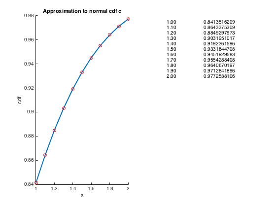

[](http://quantlet.de/)

## [](http://quantlet.de/) **SFENormalApprox3** [](http://quantlet.de/)

```yaml

Name of QuantLet : SFENormalApprox3 

Published in: Statistics of Financial Markets

Description: 'Computes numerical approximation to a normal cumulative distribution function (cdf) using method c).'

Keywords: 'approximation, cdf, distribution, graphical representation, normal, normal-distribution, numeric, plot'

See also: SFENormalApprox1, SFENormalApprox2, SFENormalApprox4

Author: Wolfgang K. Haerdle
Author[Matlab]: Wolfgang K. Haerdle

Submitted: Fri, July 24 2015 by quantomas
Submitted[Matlab]: Wed, April 27 2016 by Ya Qian

Output: 
- phi : approximation of Normal cdf at different values

Example: 'Estimated normal cdf at that points 1:0.1:2 are given: [0.8413 0.8643 0.8849 0.9032 0.9192 0.9332 0.9452 0.9554 0.9641 0.9713 0.9772].'
```




### R Code
```r

# clear variables and close windows
rm(list = ls(all = TRUE))
graphics.off()

# install and load packages
libraries = c("gplots")
lapply(libraries, function(x) if (!(x %in% installed.packages())) {
    install.packages(x)
})
lapply(libraries, library, quietly = TRUE, character.only = TRUE)

# Main computation
y   = seq(1, 2, 0.1)
a1  = 0.09979268
a2  = 0.04432014
a3  = 0.0096992
a4  = -9.862e-05
a5  = 0.00058155
t   = abs(y)
s   = 0.5 - 1/(2 * ((1 + a1 * t + a2 * t^2 + a3 * t^3 + a4 * t^4 + a5 * t^5)^8))  # computer s
phi = 0.5 + s * (-2 * (y < 0) + 1)  # if y<0, 0.5-s if y>0, 0.5+s

# Output
print(" ")
print("Estimation Points")
print(y)
print("Estimated Normal CDF")
print(phi)

# Plot
par(mfrow = c(1, 2))
plot(y, phi, lwd = 2, xlab = "x", type = "o", ylab = "cdf", main = "Approximation to normal cdf c", 
    col = "blue3")
textplot(cbind(y, phi)) 

```

automatically created on 2018-05-28

### MATLAB Code
```matlab


clear all
close all
clc

format long
% main computation
y = 1:0.1:2;
a1= 0.09979268; 
a2= 0.04432014; 
a3= 0.00969920; 
a4=-0.00009862; 
a5= 0.00058155;
t = abs(y);
s = 0.5 - 1.0./( 2.0 .* ( (1.0+a1.*t+a2.*t.^2+a3.*t.^3+a4.*t.^4+a5.*t.^5).^8 ) ); % computer s
phi = 0.5+s.*(-2*(y<0)+1); % if y<0, 0.5-s; if y>0, 0.5+s

% output
disp(' ') ;
disp('Estimation Points')
disp(y)
disp('Estimated Normal CDF')
disp(phi)

subplot(1,2,1)
hold on
plot(y,phi,'LineWidth',2);
xlabel('x')
ylabel('cdf')
title('Approximation to normal cdf c')
scatter(y,phi,'r','o')
hold off

subplot(1,2,2)
axis off
hold on
w1=num2str(y','%10.2f');
w2=num2str(phi','%11.10f');
text(0.1,0.8,w1)
text(0.5,0.8,w2)
hold off

```

automatically created on 2018-05-28