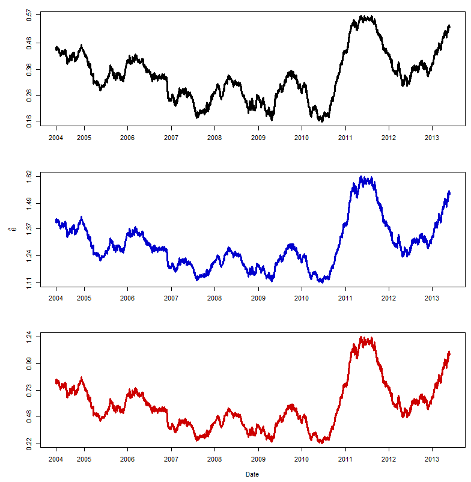

[](http://quantlet.de/)

## [](http://quantlet.de/) **SFEdynCop2dim** [](http://quantlet.de/)

```yaml

Name of QuantLet: SFEdynCop2dim

Published in: Statistics of Financial Markets

Description: 'plots the time series from estimated dependence parameter for
              the copula families Gaussian, Gumbel and Clayton. The dependence 
              parameter is estimated using the IFM method. The empirical 
              residuals are calculated using moving window of size 250'

Keywords: garch, copula, plot, normal, gumbel, clayton, Kendalls Tau, dynamic

See also: BCS_ClaytonMC, SFEstaticCop, SFEdynCop3dim

Author: Ostap Okhrin, Piedad Castro

Submitted: Tue, June 28 2016 by Piedad Castro

Input: 'The datafile contains daily price data from 07.05.2004 to 07.05.2014 for 
selected companies which are part of DAX30 and FTSE100 as well as the 
corresponding index data. This code makes use of the daily prices for the Deutsche 
Telekom and Volkswagen. It uses the date variable as well.'

Output: 'Plot: Dependence parameter of Clayton (upper panel) and Gumbel (lower panel) copulae.'

Code warning: 'There were 50 or more warnings (use warnings() to see the first 50)'

```



### R Code
```r

# clear variables and close windows
rm(list = ls(all = TRUE))
graphics.off()

# set working directory
# setwd("C:/...")

# install and load packages
libraries = c("data.table", "fGarch")
lapply(libraries, function(x) if (!(x %in% installed.packages())) {
  install.packages(x)
})
lapply(libraries, library, quietly = TRUE, character.only = TRUE)

# load data
dataset = fread("2004-2014_dax_ftse.csv", select =  c("DEUTSCHE TELEKOM", "VOLKSWAGEN"))
dataset = as.data.frame(dataset)

# log-returns
X = lapply(dataset, 
           function(x){
             diff(log(x))
           })

X = as.data.frame(X)

r.window = 250        # size of moving window
T.obs    = nrow(X)

params.cop    = NULL

for (s in r.window:T.obs){
  X.part = X[(s - r.window + 1):s, ]
  
  garchModel = lapply(X.part, 
                      function(x){
                        garchFit(~garch(1, 1), data = x, trace = F)
                      })
  
  eps = lapply(garchModel, 
               function(x){
                 x@residuals/x@sigma.t
               })
  
  # making margins uniform, based on Ranks
  eps = lapply(eps, 
               function(x){
                 rank(x)/(r.window + 1)
               })
  
  eps = as.data.frame(eps)
  
  params.cop = c(params.cop, cor(eps, method = "kendall")[1,2])
  
  print(s) # control
}

# functions to be plotted, Kendall's tau is used
gumbel.tau2theta  = function(tau){
  1/(1 - tau)
}

clayton.tau2theta = function(tau){
  2 * tau / (1-tau)
}

normal.tau2theta  = function(tau){
  sin(tau * pi/2)
}

# Date variable
data.time      = fread("2004-2014_dax_ftse.csv", select =  c("Date"))
data.time      = data.time$Date[-1]
data.time      = data.time[1:(T.obs - r.window + 1)]
data.time.Year = as.integer(format(as.Date(data.time, "%Y-%m-%d"), "%Y"))
date.ind       = which(c(1, diff(data.time.Year)) == 1)
date.labels    = data.time.Year[1]:(data.time.Year[1] + length(date.ind) - 1)

# Plot of the parameters for the copulas Normal, Gumbel and Clayton.
layout(matrix(c(1, 2, 3), 3, 1, byrow = FALSE))

par(mai = c(0.6, 0.7, 0.2, 0.1)) 
plot(normal.tau2theta(params.cop), type = "l", lwd = 3, xlab = "", ylab = "", col = "black", axes = F, frame = T)
y.labels = c(round(seq(min(normal.tau2theta(params.cop)), max(normal.tau2theta(params.cop)), length = 5) * 100) / 100, 0 )
axis(1, date.ind, date.labels)
axis(2, y.labels, y.labels)

par(mai = c(0.6, 0.7, 0.2, 0.1))
plot(gumbel.tau2theta(params.cop), type = "l", lwd = 3, xlab = "", ylab = expression(hat(theta)), col = "blue3", axes = F, frame = T)
axis(1, date.ind, date.labels)
y.labels = c(round(seq(min(gumbel.tau2theta(params.cop)), max(gumbel.tau2theta(params.cop)), length = 5) * 100) / 100, 0 )
axis(2, y.labels, y.labels)

par(mai = c(0.6, 0.7, 0.2, 0.1))
plot(clayton.tau2theta(params.cop), type = "l", lwd = 3, xlab = "Date", ylab = "", col = "red3", axes = F, frame = T, cex = 3.5)
y.labels = c(round(seq(min(clayton.tau2theta(params.cop)), max(clayton.tau2theta(params.cop)), length = 5) * 100) / 100, 0 )
axis(2, y.labels, y.labels)
axis(1, date.ind, date.labels)

```

automatically created on 2018-05-28